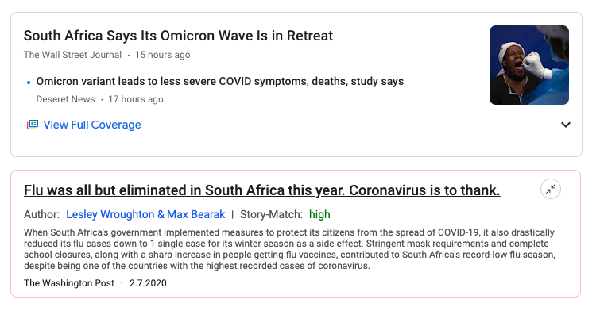

# Solutions Journalism - Semester Project
A Chrome extension that augments the Google News Feed with relevant Solutions Journalism articles.

The relevant research paper can be found in the assets folder.

### Setup
1. Open the latest version of the [Google Chrome](https://www.google.com/intl/de_de/chrome/) browser.
2. Download the `zip`-file of this repository and unpack it locally.
3. Follow [this guide](https://developer.chrome.com/docs/extensions/mv3/getstarted/#unpacked) to load the extension into Chrome.
4. Make sure to [change the language version of your Google News feed](https://support.google.com/googlenews/answer/7688469?hl=en&co=GENIE.Platform%3DDesktop) to the U.S. version.
5. Navigate to one of the two news feed versions below

### Working News Feeds
- [The U.S. country feed](https://news.google.com/topics/CAAqIggKIhxDQkFTRHdvSkwyMHZNRGxqTjNjd0VnSmxiaWdBUAE?hl=en-US&gl=US&ceid=US%3Aen)
- [The U.S. world feed](https://news.google.com/topics/CAAqJggKIiBDQkFTRWdvSUwyMHZNRGx1YlY4U0FtVnVHZ0pWVXlnQVAB?hl=en-US&gl=US&ceid=US%3Aen)

### Limitations
- The extension currently only works with the **old design** of Google Chrome, in which the different news feeds are aligned on the left hand side of the page.
- The extension currently only works with the above mentioned **two selected news feeds** in the US-version of the webpage.
- Since the owners of the biggest Solutions Journalism articles database never got back to our research requests, the backend currently only fetches **regular news articles** from an API instead of Solutions News articles.
- As there is a **usage limitation in the free version** of the keyword extraction service the extension uses, only 5 articles can be loaded every 10 minutes. To not show unintended error messages on the site, **only the top news article** is augmented with the extension's articles.

**Author**: Christopher Voit
